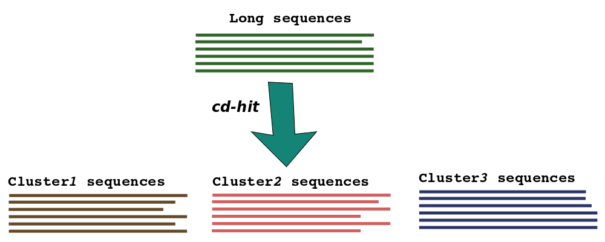
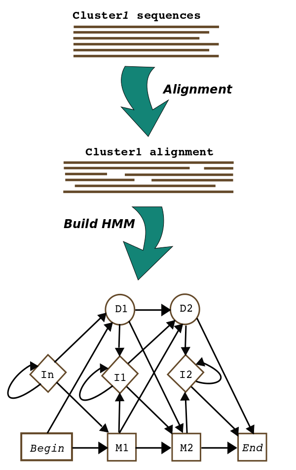
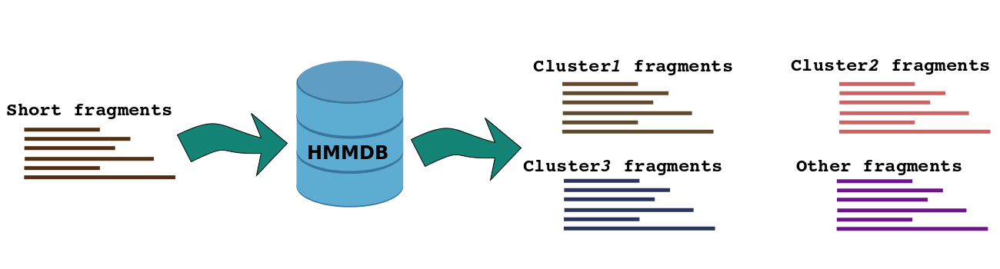
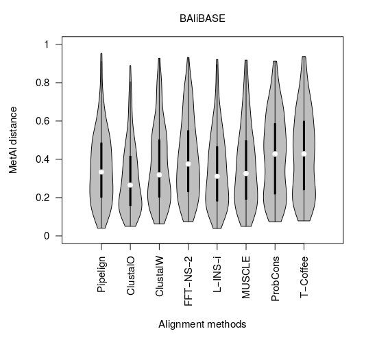
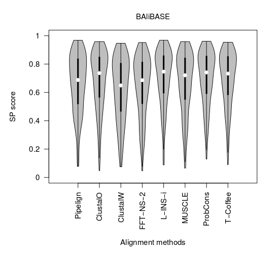
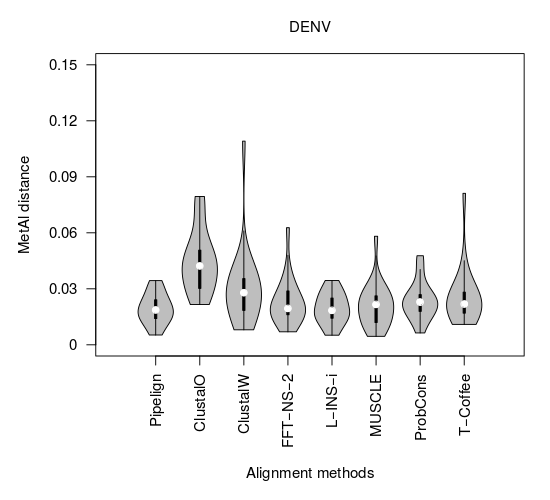
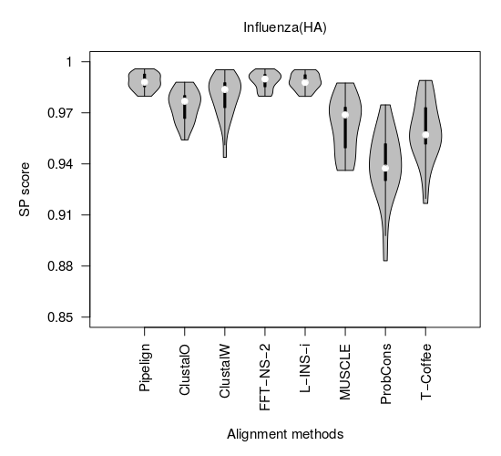

## Sequence Alignment Pipeline
  
**Mukarram Hossain**  
Department of Veterinary Medicine  
University of Cambridge
  
  

&nbsp;

---

## Multiple sequence alignment

- Evolutionary studies typically start by aligning molecular sequences
- Multiple sequence alignment (MSA) represents the shared evolutionary history among a group of sequences
- Sequences are aligned by establishing sitewise homology among related residues
- Alignments inform us about:
    - evolutionary process
    - structural/functional diversity
    - pattern of selection
    - and many others

---

## Sequence alignment

- Computational tools are used to automatically align set of sequences
- Residues (e.g. A, T, C, G) placed together in columns are believed to have evolved from a common ancestor
- Mismatch between residues represents substitution
- Gaps ('-') in the alignment usually denote insertion/deletion

&nbsp;

---

## Do we need a new aligner?

- Majority of the aligners are developed for mammalian sequences
- Viruses evolve differently than mammals:
    - high mutation rate
    - fast generation time
    - error prone replication
    - higher indel rate
    - frequent recombination
- Viruses are 'measurably evolving' 

---

## Do we need a new aligner?

  

- Aligners often fail to produce accurate alignment of virus sequences
- Sequence data may contain whole genome, complete genes or short fragments
- Unreliable sequences can be present

---

## Alignment Pipeline (Pipelign)

  

- We have developed a semi-automatic alignment pipeline for virus sequences
- Pipelign progressively aligns groups of sequences
- Systematically identifies potential unrelated fragments
- Cluster of alignments are merged together 

---

## Pipelign - split 

    

&nbsp;

---

## Pipelign - Clustering

    

&nbsp;

---

## Pipelign - Align & HMM

&nbsp;

---

## Pipelign - HMM database

&nbsp;

---

## Pipelign - Cluster fragments

  

&nbsp;

---

## Pipelign - Align fragments

&nbsp;

---

## Pipelign - Merge clusters

&nbsp;

---

## Benchmarking

  

- Process of evaluating by comparison with a standard
- Alignment tools are usually benchmarked using mammalian structural protein databases:
    - BAliBASE
    - PREFAB
    - HOMSTRAD
    - Simulation
- No standard for virus sequence alignments

---

## Benchmarking - Metrices

  

- Alignments are generated by different methods
- Compared with the 'TRUE' structural alignment
- Accuracy is measured by calculating percentage of alignment sites matching/mismathing the 'TRUE'  alignment
- MetAl, FastSP

---

## BAliBASE

  

- Developed and managed by Julie Thompson et al.
- Contains 218 full length and 168 homologous sequence sets and their TRUE alignments
- Divided into 6 groups

---

## BAliBASE - MetAl

  

&nbsp;

---

## BAliBASE - MetAl

&nbsp;

---

## BAliBASE - SP

&nbsp;

---

## PREFAB

  

- Developed by Robert Edgar
- Was used to benchmark MUSCLE
- Contains 1682 alignments

---

## PREFAB - MetAl

&nbsp;

---

## PREFAB - SP

&nbsp;

---

## Simulation

  

- Two datasets are simulated using INDELible:
    - DENV
    - Influenza HA gene
- Each datasets contain 20 replicates of 100 sequences 
- Simulation starts with a 1000bp long root sequence
- Substitutions, insertions and deletions are applied

---

## DENV - MetAl

&nbsp;

---

## DENV - SP

&nbsp;

---

## Influenza - MetAl

&nbsp;

---

## Influenza - SP

&nbsp;

---

## Work in Progress

  

- PANGEA simulated sequences
- Work with ambiguous sequences
- Finalise the pipeline
- Develope Docker container and Biobox container

---

    
